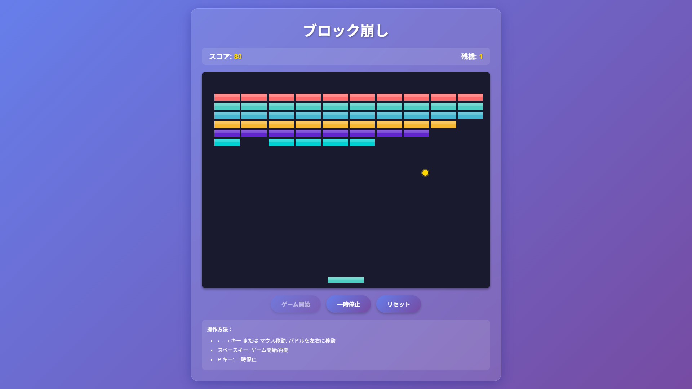

# ブロック崩しゲーム (Breakout Clone)



## 概要

クラシックなブロック崩しゲームのWeb版実装です。HTML5 Canvas、CSS、JavaScript を使用して作成されています。

## 特徴

- **シンプルな操作**: マウスでパドルを操作
- **レスポンシブデザイン**: 様々な画面サイズに対応
- **スムーズなアニメーション**: requestAnimationFrameを使用した滑らかな動作
- **効果音付き**: ゲーム内イベントに合わせた音響効果

## ゲームルール

1. パドルを左右に動かしてボールを跳ね返す
2. 上部のブロックをすべて破壊する
3. ボールを落とさないよう注意する
4. 全ブロック破壊でゲームクリア

## 技術仕様

- **HTML5 Canvas**: ゲーム画面の描画
- **JavaScript ES6+**: ゲームロジック実装
- **CSS3**: スタイリングとレスポンシブ対応

## プレイ方法

### オンライン版
[GitHub Pages でプレイ](https://takamiya1021.github.io/app004-Breakout-clone/)

### ローカル実行
```bash
# リポジトリをクローン
git clone https://github.com/takamiya1021/app004-Breakout-clone.git
cd app004-Breakout-clone

# ローカルサーバーで起動
python3 -m http.server 8000

# ブラウザで開く
open http://localhost:8000
```

## ファイル構成

```
app004-Breakout-clone/
├── index.html      # メインHTML
├── style.css       # スタイルシート
├── game.js         # ゲームロジック
├── screenshot.png  # ゲーム画面
└── README.md       # このファイル
```

## 開発情報

- **開発者**: あおいさん & クロ (Claude Code CLI)
- **開発期間**: 2025年8月
- **ライセンス**: MIT License

## 今後の改善予定

- [ ] スコアシステムの実装
- [ ] レベル選択機能
- [ ] ハイスコア保存機能
- [ ] モバイル対応の向上
- [ ] 効果音の追加

---

🎮 楽しいゲーム体験をお楽しみください！